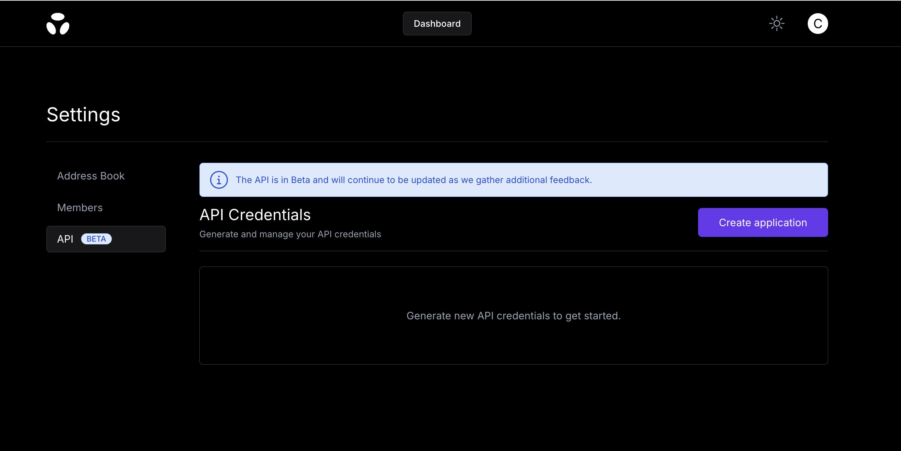

# Quick Start

## 1. Create a Brale account

Visit https://app.brale.xyz/signup to sign up for a Brale account. You will need to complete KYB before you are approved for API access.

## 2. Create API credentials

Create an application on the [Settings](https://app.brale.xyz/settings?tab=api) page in the Dashboard. Brale will make your API key available only once. Please save the key in a secure location.



## 3. Authenticate

Brale uses OAuth2 with the `client_credentials` grant type for secure access to our APIs. Sending a request to the Auth endpoint will return a bearer token to be used on all subsequent calls. The Authorization header uses Basic HTTP Authentication and requires encoding your `client_id` and `client_secret` into a Base64 format.

```shell
curl --request POST \
  --url https://auth.brale.xyz/oauth2/token \
  --header 'Authorization: Basic ${BASE_64_OF(client_id:client_secret)}' \
  --header 'Content-Type: application/x-www-form-urlencoded' \
  --data grant_type=client_credentials
```

## 4. Create your first transfer

Use Transfers to initiate funds movement from fiat to stablecoins (onramp), stablecoins to fiat (offramp), or stablecoins to stablecoins.

Here’s an example of onramping USD to your own stablecoin (YSBC) via wire transfer.

POST https://api.brale.xyz/accounts/your_account_id/transfers

```json
{
  "amount": {
    "value": "10",
    "currency": "USD"
  },
  "source": {
    "value_type": "usd",
    "transfer_type": "wire"
  },
  "destination": {
    "address_id": "string",
    "value_type": "ysbc",
    "transfer_type": "solana"
  }
}
```

Now that you've completed your first transfer, follow Guides to get a deeper understanding of how to build with Brale.
